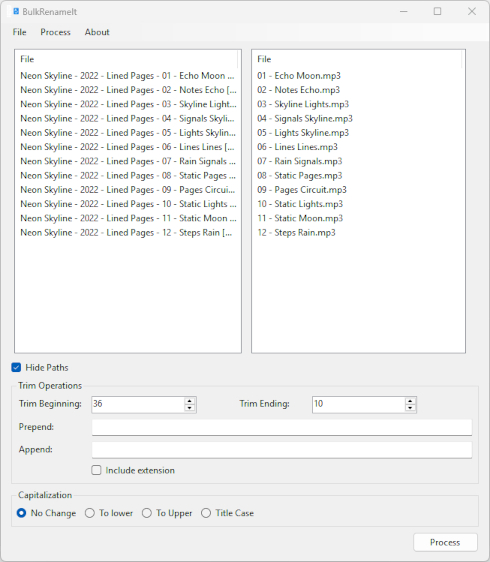

# BulkRenameIt

BulkRenameIt is a fast, lightweight bulk file renaming utility for Windows, written in C# and targeting .NET 10.

BulkRenameIt includes a companion tool, MockMediaGenerator, which creates sample folders filled with mock files (albums, TV episodes, ROM collections, etc.) to test or demonstrate renaming workflows.

## Features
* Filename Transformations
  * Trim N characters from start/end
  * Prepend or append text
  * Toggle including/excluding file extensions
* Capitalization modes:
  * None
  * lowercase
  * UPPERCASE
  * Title Case
* Preview-First Workflow
  * Real-time preview of new filenames
  * No file operations performed until the user confirms

## Project Structure
### BulkRenameIt
The main GUI application.
Built with WinForms on .NET 10. Ideal for users who want total control over large batches of filenames.

### MockMediaGenerator
A small console utility that generates synthetic file sets such as:
* Music albums with track prefixes
* TV or streaming-style episode folders
* Video game ROM directories
* Misc collections with prefix/suffix noise

Useful for:
* Testing renaming rules
* Creating demo folders for screenshots/tutorials
* Reproducing cluttered folder structures for user testing

## License
MIT License
See LICENSE for full details.

## History
This tool originated back in 2018 for .Net Framework 4.5 as a one-off. This new version is an update and re-release of that original tool after it was found with some archived works.